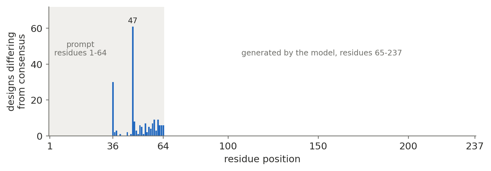

# Divergence analysis: finetuned ProGen2 GFP designs

Top five candidates by mean pLDDT, compared against the consensus sequence of
`data/train.txt` (47,854 sequences, all exactly 237 residues; consensus = most
frequent residue at each position). All five pass the pTM >= 0.8 threshold, as do all 92 designs, with pTM ranging 0.89 to 0.92.

---

## 1. Substitution table

Each substitution is written `<consensus residue><position><design residue>`,
1-indexed. Positions 1 to 64 are the supplied prompt; positions 65 to 237 are
generated by the model.

| Rank | Design | mean pLDDT | pTM | Substitutions vs consensus | Count |
|-----:|--------|-----------:|----:|----------------------------|------:|
| 1 | `gfp_design_034` | 92.51 | 0.92 | C47Y, T62A | 2 |
| 2 | `gfp_design_092` | 92.50 | 0.92 | A36V | 1 |
| 3 | `gfp_design_008` | 92.44 | 0.92 | A36T, V54A | 2 |
| 4 | `gfp_design_027` | 92.44 | 0.92 | A36T, V54M | 2 |
| 5 | `gfp_design_040` | 92.41 | 0.92 | C47S, T58A, L59P | 3 |

---

## 2. Positional distribution

Substitution counts per residue position across all 92 designs, 188
substitutions in total. Generated by `plot_positional_distribution.py`.

{width=100%}

- Every substitution lies between positions 36 and 64.
- Positions 1 to 35: no design differs from consensus.
- Positions 65 to 237: no design differs from consensus, across all
  92 x 173 = 15,916 generated positions.
- Position 47 alone accounts for 61 of the 188 substitutions, and position 36 for a further 30. The remaining 97 are spread over 22 positions.

The prompt occupies positions 1 to 64, so all of the observed divergence came from the prompt and none from the model. Of the 237 positions, 213 are identical across all 92 designs.

---

## 3. Decoding strategy

Greedy decoding, configured in `inference.py`:

| Parameter | Value | Source |
|-----------|-------|--------|
| `DECODING_STRATEGY` | `"greedy"` | `inference.py:23` |
| Token selection | `torch.argmax(lm_probs, dim=-1)` | `model.py:753` |
| `MAX_SEQ_LENGTH` | 512 | `inference.py:22` |
| `BATCH_SIZE` | 1 | `inference.py:12` |
| Prompt | first 64 residues of each `data/test.txt` line, preceded by BOS | `dataset.py` |
| Termination | generated EOS token, else the 512-token cap | `model.py:768` |
| Seed | `torch.manual_seed(0)` | `inference.py:9` |
| Checkpoint | `models/best_checkpoint.pt` (epoch 1, `valid_loss` 0.0893) | `inference.py:31` |

Greedy decoding is deterministic and does not consume the seed, so
`torch.manual_seed(0)` has no effect on these outputs. It would matter only
under `topp`. The `topp` branch exists in `model.py` with a nucleus threshold
of `0.8` and was not used here.

All 92 outputs terminated on EOS at exactly 237 residues, the same length as
every training sequence. None hit the 512-token cap.

---

## 4. Interpretation

Across the generated region (positions 65 to 237), the finetuned model
reproduced the training-set consensus exactly for all 92 designs, 15,916
generated positions with zero deviation. Its contribution to each design was
exact recovery of the GFP family consensus rather than new sequence content:
given any 64-residue GFP prefix, it completes the remaining 173 residues to the
canonical scaffold. The training distribution is extremely tight (98.4% mean
per-position conservation, no position below 90%), final validation loss was low
at 0.0893, and greedy decoding always takes the argmax, so it can only emit the
family's modal residue. The pLDDT ranking therefore does not separate model
behaviors; it ranks the prompts. The only sequence differences between
candidates are the 1 to 4 substitutions each prompt carried in positions 36 to
64, and AlphaFold3 mildly penalizes divergence from consensus: mean pLDDT falls
monotonically from 91.90 (0 substitutions) to 91.39, 91.24, 91.03 and 87.28 as
substitution count rises from 1 to 4 (Pearson *r* = -0.237). That correlation is
weak, and the top five span only 0.10 pLDDT, smaller than the ~1.1-unit spread
between AlphaFold3's own five random seeds on a single design. The five are
statistically indistinguishable, and their internal ordering, including the
exact tie at 92.44 between ranks 3 and 4, should be treated as noise. All 92
designs fold confidently as GFP, and the ranking mainly reflects how far each
supplied prompt strayed from the consensus rather than any creative contribution
from the finetuned model.

### Caveat on the learning-rate schedule

`train.py:59` sets `optimizer.lr = lr`, but PyTorch optimizers read their learning rate from `optimizer.param_groups[0]['lr']`. Assigning `.lr` creates an unused attribute, so the intended inverse-square-root decay never took effect and training ran at a constant `1e-3`. Validation loss confirms this: it reached its minimum at epoch 1 (0.0893), then oscillated between 0.0901 and 0.1232 for nine further epochs without improving. This likely indicates that the learning rate that never anneals. The saved checkpoint is therefore the epoch-1 model.

---

## 5. Predicted structures

AlphaFold3 cartoon models of the top five, colored by pLDDT: dark blue above 90, light blue 70 to 90, yellow 50 to 70. Each is the highest-ranked of the five models AlphaFold3 returned for that job.

{width=52%}

{width=52%}

{width=52%}

{width=52%}

{width=52%}

All five adopt the same eleven-stranded beta-barrel with a central helix running through its axis, which is the expected GFP fold. The barrel itself is uniformly dark blue in every model, so the differences in mean pLDDT between candidates do not come from the structured core.

Only two regions drop below 70 pLDDT, and they are the same two in all 92
designs. Averaged per residue across the full set:

| Region | Residues | Mean pLDDT | Visible as |
|--------|----------|-----------:|------------|
| Beta-barrel core | most of 1 to 237 | 91.44 overall | dark blue |
| Chromophore tripeptide | 64 to 67 (S-Y-G at 64 to 66) | 63.7 at the minimum (residue 65) | yellow inside the barrel |
| C-terminal tail | 230 to 237 | 50.2 to 66.4 | yellow tail outside the barrel |

The chromophore dip is expected. In mature GFP the Ser-Tyr-Gly tripeptide
cyclizes into the chromophore, and AlphaFold3 models it as ordinary
polypeptide, so lower confidence there reflects the chemistry rather than a
defect in the design. The C-terminal tail is the disordered terminus and matches
the `fraction_disordered` of 0.02 that AlphaFold3 reports.

Residues 65 and 66 fall below 70 pLDDT in 92 of 92 designs. That boundary
coincides with the end of the 64-residue prompt, but the coincidence is
numerical: the low-confidence window is the chromophore site, and it sits at
that position in every GFP sequence in the training set regardless of where the
prompt happened to stop.

### Sequences

FASTA, wrapped at 60 residues per line. Residues 1 to 64 are the supplied
prompt; the rest is model output and is identical to the consensus in all five.
The positions where each sequence differs from the consensus are listed in
section 1.

```
>gfp_design_034 | rank 1 | 237 aa
SKGEELFTGVVPILVELDGDVNGHKFSVSGEGEGDATYGKLTLKFIYTTGKLPVPWPTLV
TALSYGVQCFSRYPDHMKQHDFFKSAVPEGYVRERTIFFKDDGNYKTRAEVKFEGDTLVN
RIELKGIDFKEDGNILGHKLEYNYNSHNVYIMADKQKNGIKVNFKIRHNIEDGSVQLADH
YQQNTPIGDGPVLLPDNHYLSTQSALSKDPNEKRDHMVLLEFVTAAGITHGMDELYK
>gfp_design_092 | rank 2 | 237 aa
SKGEELFTGVVPILVELDGDVNGHKFSVSGEGEGDVTYGKLTLKFICTTGKLPVPWPTLV
TTLSYGVQCFSRYPDHMKQHDFFKSAVPEGYVRERTIFFKDDGNYKTRAEVKFEGDTLVN
RIELKGIDFKEDGNILGHKLEYNYNSHNVYIMADKQKNGIKVNFKIRHNIEDGSVQLADH
YQQNTPIGDGPVLLPDNHYLSTQSALSKDPNEKRDHMVLLEFVTAAGITHGMDELYK
>gfp_design_008 | rank 3 | 237 aa
SKGEELFTGVVPILVELDGDVNGHKFSVSGEGEGDTTYGKLTLKFICTTGKLPAPWPTLV
TTLSYGVQCFSRYPDHMKQHDFFKSAVPEGYVRERTIFFKDDGNYKTRAEVKFEGDTLVN
RIELKGIDFKEDGNILGHKLEYNYNSHNVYIMADKQKNGIKVNFKIRHNIEDGSVQLADH
YQQNTPIGDGPVLLPDNHYLSTQSALSKDPNEKRDHMVLLEFVTAAGITHGMDELYK
>gfp_design_027 | rank 4 | 237 aa
SKGEELFTGVVPILVELDGDVNGHKFSVSGEGEGDTTYGKLTLKFICTTGKLPMPWPTLV
TTLSYGVQCFSRYPDHMKQHDFFKSAVPEGYVRERTIFFKDDGNYKTRAEVKFEGDTLVN
RIELKGIDFKEDGNILGHKLEYNYNSHNVYIMADKQKNGIKVNFKIRHNIEDGSVQLADH
YQQNTPIGDGPVLLPDNHYLSTQSALSKDPNEKRDHMVLLEFVTAAGITHGMDELYK
>gfp_design_040 | rank 5 | 237 aa
SKGEELFTGVVPILVELDGDVNGHKFSVSGEGEGDATYGKLTLKFISTTGKLPVPWPAPV
TTLSYGVQCFSRYPDHMKQHDFFKSAVPEGYVRERTIFFKDDGNYKTRAEVKFEGDTLVN
RIELKGIDFKEDGNILGHKLEYNYNSHNVYIMADKQKNGIKVNFKIRHNIEDGSVQLADH
YQQNTPIGDGPVLLPDNHYLSTQSALSKDPNEKRDHMVLLEFVTAAGITHGMDELYK
```

For reference, the consensus of `data/train.txt`:

```
>consensus | 47,854 training sequences | 237 aa
SKGEELFTGVVPILVELDGDVNGHKFSVSGEGEGDATYGKLTLKFICTTGKLPVPWPTLV
TTLSYGVQCFSRYPDHMKQHDFFKSAVPEGYVRERTIFFKDDGNYKTRAEVKFEGDTLVN
RIELKGIDFKEDGNILGHKLEYNYNSHNVYIMADKQKNGIKVNFKIRHNIEDGSVQLADH
YQQNTPIGDGPVLLPDNHYLSTQSALSKDPNEKRDHMVLLEFVTAAGITHGMDELYK
```
